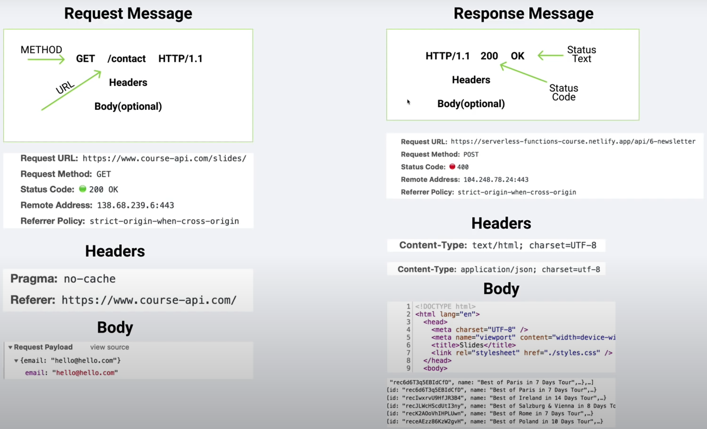
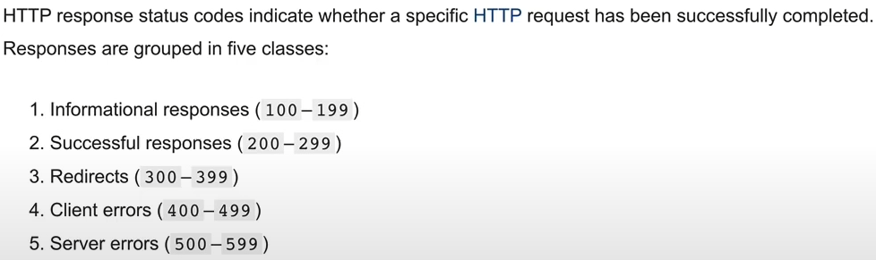
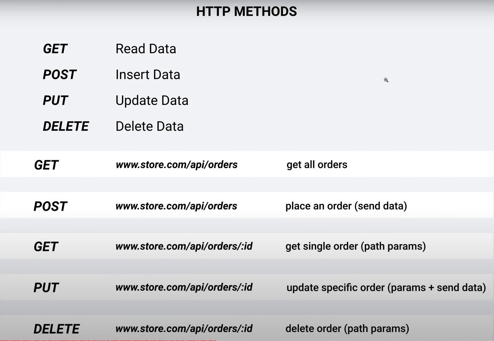
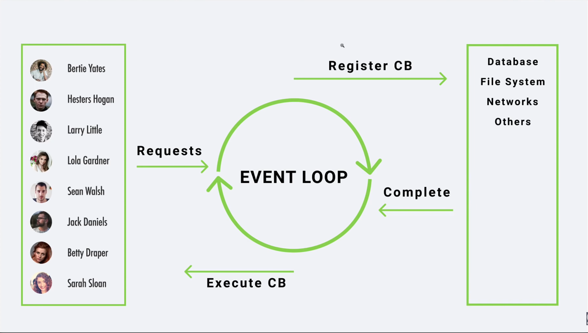

# **_Node Js & Express Js_**

Node Js allow us to run Js Code outside the browser, it was build on chrome's V8 Js Engine (Tool that compiles our code into machine code!), and also let us create secure, functional and escalable _FullStack Web Applications_ way easier!<br>

---

<br>

### **Requirements**

<br>
Basic Understandin on:

~ Html.<br>
~ Css.<br>
~ Js: ES6.<br>

- Callbacks.<br>
- Promises.<br>
- Asynd-Await.<br>

<br><br>

### **What You Will Learn**

<br>

~ Node fundamentals.<br>

- Complex Rest API
- Mern App
- Projects.

~ Express Js.<br>
~ mongoDB.<br>
~ Mongoose.<br>
~ Aplicaitons.<br>
~ Deployment.<br>

<br>

---

<br>

## **~ Introduction**

<br><br>

Differences between Browser's and Node Js

| Browser          | Node Js          |
| ---------------- | ---------------- |
| DOM              | No DOM           |
| Window           | No Window        |
| Interactive Apps | Server Side Apps |
| No Filesystem    | Filesystem       |
| Fragmentation    | Versions         |
| ES6 Modules      | Common Js        |

<br>

### **Install Node Js**

<br>

Navidate to [NodeJs](https://nodejs.org/en/) and download the LTD version (Long Term Support).

Once installed, check in your terminal with the command **node --version** to check the version and verify everything is correct!

<br>

### **How do we get Node to evaluate our code?**

<br><br>

#### **REPL (Read-Eval-Print Loop)**

<br>

It bassicaly takes the user inputs, executes them and returns the result to the user.

<br>

**_How can we use REPL?_**

~ We have to type **node** and hit enter, the we will have an angle bracker **>**, this means we are inside the REPL.

```typescript
PC C: something> node
> const success = 1;
> success
1
```

To exit the REPL just hit **CTRL + C** \* 2

<br>

#### **CLI (Command Line Interface)**

<br>

Allows the user to respond to visual prompts by typing single commands into the interface and receiving a reply in the same way.

<br>

So instead of writting our code inside the terminal, we can run a serious Node application typing **node + filePath** and it'll handle everything!

```typescript
PC C: something> node app.js
```

<br>

#### **Which one should I choose?**

<br>

REPL is often used to starters and playing around, CLI is used for everything else, for beginners, playing around on REPL is perfect, but, for mastering your skills, CLI will do the job!

<br><br>

## **~ Node Fundamentals**

<br> <br>

### **GLobals**

<br>

No matter where we are in the application, we can always access these variables.

Some variables:

~ \_\_dirname: Path to current directory.<br>
~ \_\_filename - file name.<br>
~ require - function to use modeules (CommonJs).<br>
~ module - info about current module (file).<br>
~ process - info about environment where the program is being executed.

<br>

### **Modules (Encapsulated code)**

<br>

As we are only calling one file it's extremly complex to writte and entire app in just one file, so we have to split it on modules!

Every file is a module by default, so after creating a new file with our needed code we can export what we only need by using **module.exports** and setting it to an object with the varibales we want to share!

```javascript
// local
const secret = "secret";

// shared
const hello = "Hi, How are you!?";
const bye = "Bye, Nice to meet you!";

// exports
module.exports = { hello, bye };
```

On the main file, we can import this information by using **require**!

```javascript
// imports
const phrases = require("./filepath");

~ Notice inside the require parenthesis we set the file path where we are exporting our data.
~ Now, 'phrases' has the object: {hello, bye}.

~ We can also destructure the object:
const { hello, bye } = require("./filepath");
```

<br>

#### **Alternative Flavor**

<br>

We can also export our code by:

```javascript
module.exports.items = [1, 2];

const device = {
  name: "kerboard",
};
module.exports.electronicDevice = device;
```

<br>

### **Mind Grenade**

<br>

Instead of setting out the modules, once we require a file without asign it to a variable it'll invoque what's inside the called file.

<br>

### **Built-In Modules**

<br>

Here are some of the most used Built-In Modules!
I'll briefly explain some of the uses and methods each module has, so don't think this is all we have!

<br>

#### **OS**

<br>

Provides many useful properties and methods for interacting with the operating system as well as the server.

<br>

_How to import?_

```javascript
const os = require("os");
```

_How to access it's methods and properties?_

```javascript
// Info about the current user
const user = os.userInfo();

// How long the computer has been running
const upTime = os.uptime();
```

<br>

#### **PATH**

<br>

Let's you interact with path's easily.

<br>

_How to import?_

```javascript
const path = require("path");
```

_How to access it's methods and properties?_

```javascript
// Get our actual path
const ourPath = path.sep();

// How to normalize path's
const filePath = path.join("/som/", "folder", "file.txt"); // it'll return '/som/folder/file.txt'

// Imagine we have a file.txt and we want to read what's inside of it
const base = path.basename(filePath); // Here we will get the text inside the file.

// So, you want an absolute path?
// Here we will set the same path to our file.txt we set on the 'filePath' variable
const absolutePath = path.resolve(__dirname, "som", "folde", "file.txt"); // Remember the global variables? __dirname will provide our current path and .resolve will join that path with the variables we pass
```

<br>

#### **FS (File System)**

<br>

There are two flavors when it comes to file module:

<br>

**_~ Sync (Blocking)_**

<br>

```javascript
// So, do you want to read and write a file?
// First, we implement FS by destructuring the readFileSync and writeFileSync!
const { readFileSync, writeFileSync } = require("fs");

// To get the data from a file we have to call the readFileSync function and set the parameters: 1. File path. & 2. Character encoding.
const dataFile = readFileSync("./folder/subfolder/file.txt", "utf8");

// To create or write on a file, we have to call the writeFileSync function and set the parameters: 1. File name. (If the file name doesn't exits, node will created automaticly) & 2. Data.
writeFileSync("./folder/subfolder/myFile.txt", "Hey, this is my file!");

// With only two parameters we are creating or overwriting the data inside selected file, but if we want to append it, we must pass an extra parameter: 3. append.
writeFileSync("./folder/subfolder/myFile.txt", "Hey, this is my file!", {
  flag: "a",
});
```

<br>

**_~ Async (Non-Blocking)_**

<br>

```javascript
// If we want to recreate the read and write methods from the Async examples, we now have to implement CallBacks!

// Instead of requiring Sync functions we now need to call Async functions!
const { readFile, writeFile } = require("fs");

// Now on the readFile we have a third parameter, the 'callback' function, which will tell us if the program failed or succeeded!
readFile("./myFile.txt", "utf8", (error, result) => {
  if (error) {
    console.log(error);
    return;
  }

  // The callback also apply on the writeFile function!
  writeFile(
    "./mySecondFile.txt",
    `Here is the result from the first file: ${result}`,
    (error, result) => {
      if (error) {
        console.log(error);
        return;
      }

      console.log("success!");
    }
  );
});
```

<br>

**_~ Sync Vs Async!_**

<br>

_Sync is a line-by-line reader that will be executing the code as it's reading it, this could have an impact on performance if we are working with several users and demanding tasks, creating death time for the user, waiting until the tasks from other users are done._

_Async is a background worker, it's not a line-by-line reader, so it could be doing more tasks while the async function is still running in the background, making the workflow a lot more consistent and fluid, decreasing the death time for the user._

<br>

#### **HTTP**

<br>

The server side AKA Http Module, allow us to create a web server!

Here we will take a brief examples on how to create a server as well as implementing methods to interact with the server.

<br>

_How to import?_

```javascript
const http = require("http");
```

_Now, How can we create a server?_

```javascript
const server = htpp.createServer((req, res) => {});

~ The request parameter returns an object with useful methods and variables from your server.
~ The response is what we are returning.
```

    The create method from the http ,module, is looking for a callback.

    ~ For good practices is commonly called the first parameter "req" for the request and the second parameter "res" for the response.

<br>

As we are creating our server, we need to set a port for the server to be listening to:

```javascript
server.listen(5000);

The port is completely arbitrary, you can choose whatever you want
```

<br>

Now, we are going to create a short example using the url as well as the write method from the response variable, it should look like this:

```javascript
const http = require("http");

const server = http.createServer((req, res) => {
  switch (req.url) {
    case "/":
      res.write("Welcome, hope you're getting fun");
      break;
    case "/about":
      res.write("You now discovered some of our history! Well done!");
      break;
    default:
      res.write(`<h1>Ohh...</h1>
    <p>We couldn't find the page you are looking for :(</p>
    <a href="/">Home</a>`);
      break;
  }
  res.end();
});

server.listen(5000);

~ Notice we extract the url by using a request method and also write on our web page by a response method!
~ Once we send back our response, we MUST end our conexion by using res.end().
~ Finally we set the port the server will listen to.
```

<br>

**How we exchange data over the internet?**

<br>

Once we search for a web application via url, we are actually calling a server to handle our request and send us back the response with the data we were asking for.

<br>

**Http Messages**

<br>
Structure:



~ Request messages is what the user is sending. <br>
~ Response messages is what the server is sending.

<br>

_Headers:_

They are just the meta information about our request and they are opcional.

```javascript
res.writeHead(200, { "content-type": "text/html" });
```

This _.writeHead_ will give the server extra information about the response we are sending, the first parameter corresponds to the status code, and the second parameter corresponds to an object that containt crusial information about whats being send.

**NOW WE CAN READ HTML FILES AND PASS THEM AS A PARAMETER FOR THE** **_.write() | .end()_** **FUNCTION FROM THE 'res' PARAMETER INSIDE THE CREATE SERVER FUNCTION**

**Status Code**

There are plenty of status codes related to sending, handling and recieving data



[want more info!?](https://developer.mozilla.org/en-US/docs/Web/HTTP/Status)
<br>

**content-type**

Over the content type we need to cover what's going to be sent to the user, we need to specify what kind of information we are sending, for example, if we are sending an entire page on Html we must set the value as "text/html", 'text/' will mostly be on every value, what does change is the after slash content, this may differ on Html, plain and more!

We need to take into account if we try to send an html code with a content-type of 'text/plain', this will not show the user what we might expect, it'll show exactly the code we wrote because we are sending 'plain' text!

<br>

_Body:_

If the user wants to add a resource on the server then the body comes handy, otherwise its not necessary(optional).

<br>

**Http Methods**

<br>



We can also retrieve what method is being used, by using the 'method' method from the 'req' parameter from the server!

```javascript
const method = req.method;
```

~ Remember always calle this method inside the callback of the server!

<br>

We have to remember not all of these configurations have to be made by the developer, we are just trying to understand what's happening behind the scenes, there are plenty of packages that makes the work for us!

---

<BR>

### **IMPORTANT**

Once we create our application, we need to set manually all of our paths, files, and more!
But there is one important thing to keep in mind, we know reading an HTML file with an FS module and printing it out with the response method of HTTP, we can easily see the information, but what does actually happens when we try to read a CSS file or a javascript file?

<br>

_Hint:<br>~ It will return a 404 error_

<br>

But why?

As the html file is requesting the css and the javascript files, we also need to handle its own paths, meaning we also need to create a validation for each file. terrifying

_But don't worry we will solve most of our problems with express!_

Here is a short example of a page with styling (css) and logic (javascript):

```javascript
// Import modules

const http = require("http");
const { readFileSync } = require("fs");

// Import files

const html = readFileSync("./index.html");
const javascript = readFileSync("./handler.js");
const css = readFileSync("./style.css");
const logo = readFileSync("./logo.svg");

// Server

http
  .createServer((req, res) => {
    switch (req.url) {
      case "/":
        res.writeHead(200, { "content-type": "text/html" });
        res.write(html);
        res.end();
        break;
      case "/handler.js":
        res.writeHead(200, { "content-type": "text/javascript" });
        res.write(javascript);
        res.end();
        break;
      case "/style.css":
        res.writeHead(200, { "content-type": "text/css" });
        res.write(css);
        res.end();
        break;
      case "/logo.svg":
        res.writeHead(200, { "content-type": "img/svg+xml" });
        res.write(logo);
        res.end();
        break;
      default:
        res.writeHead(404, { "content-type": "text/html" });
        res.write("<h1>Page not found!</h1> <br> <h1>404</h1>");
        res.end();
        break;
    }
  })
  .listen(5000);
```

**~ For png and jpg images just use 'text/png' or 'text/png' as the content-type value!**

<BR>

---

### **NPM (Node Package Manager)**

<br>

At this point, we are only familiar with our own modules and the node build-in ones, but we also have access to a big code store _"NPM"_.

NPM allows us to reuse our code for different projects and import code written from other developers to ease our project and we also could share our own solution with other developers!

<br>

_Want to see more?_

~ [NPM](https://www.npmjs.com/)

<br>

This containers of code are often called:

- Package,
- Dependecis.
- Modules.

<br>

There is no security control over npm, anyone could upload anything!

<br>

**_How to start using NPM?_**

<br>

Once we installed Node Js, we also installed NPM, so we can use it right away!

Here are some useful commands for downloading packages with npm in the terminal:

```
1. global comand

~ npm

2. Check version

~ npm --version

3. Local Dependency - Use packages on local projects

~ npm i <packageName>

4. Global Dependency - Use Packages on any proyect

~ npm install -g <packageName>

~ sudo npm install -g <páckageName> (Mac)


<!-- By default all the modules we installed, are stored in the "node_modules" folder -->


5. Package.json - Manifest file (Stores important info about project/package)

~ Manual approach (Create package.json in the root, create properties etc)

~ npm init (step by step, press enter to skip)

~ npm init -y (Everything default)


<!-- The package.json is crucial when it comes to sharing your project and working with other developers. -->

6. Dev Dependency

~ npm i <packageName> -D

~ npm i <packageName> --save-dev

<!-- We use DevDependecies for modules that help us develop our application, like testing packages, but as soon we upload our application we could get rid of them! -->

7. Unistall Packages

~ npm uninstall <packageName>
```

<br>

---

<br>

_how does a package.json looks like?_

```json
{
  "name": "VsCode",
  "version": "1.0.0",
  "description": "",
  "main": "app.js",
  "scripts": {
    "test": "echo \"Error: no test specified\" && exit 1"
  },
  "keywords": [],
  "author": "",
  "license": "ISC"
}
```

_now with dependencies_

```json
{
  "name": "VsCode",
  "version": "1.0.0",
  "description": "",
  "main": "app.js",
  "scripts": {
    "test": "echo \"Error: no test specified\" && exit 1"
  },
  "keywords": [],
  "author": "",
  "license": "ISC",
  "dependencies": {
    "lodash": "^4.17.21"
  },
  "devDependencies": {
    "nodemon": "^2.0.7"
  }
}
```

<br>

---

<br>

Just as we want to share our code, we must keep in mind we can't just upload the "node_modules" folder, so we have to create an ignore file for wherever we want to upload our project

<br>

For github we can create a .gitignore file that should look like this:

```
/node_modules
```

This way we are avoiding carrying our node_modules file.

<br>

_Now, you should be wondering, How can we get the modules back once we clone the project?_ <br>

_~ Once we cloned the project we only have to use the command:_

```
npm install
```

_This will install all the dependencies written inside the "package.json" file and set your project again_

<br>

**How can we create commands with npm?**

<br>

To create commands we need to create an object called "scripts" inside the 'package.json' file, declaring the name of the command and setting its function.

We are going to create and example, we will replace 'node app.js' command for the 'npm start' command:

```json
"scripts": {
  "start": "node app.js"
}
```

This is how the json should look like:

```json
{
  "name": "VsCode",
  "version": "1.0.0",
  "description": "",
  "main": "app.js",
  "scripts": {
    "test": "echo \"Error: no test specified\" && exit 1",
    "start": "node app.js"
  },
  "keywords": [],
  "author": "",
  "license": "ISC",
  "dependencies": {
    "lodash": "^4.17.21"
  },
  "devDependencies": {
    "nodemon": "^2.0.7"
  }
}
```

Notice the scripts object now contains the start command, allowing us to use:

```
npm start
```

instead of:

```
node app.js
```

<br>

**NPX**

<br>

Works as an alternative to installing global packages, years ago we had to install the create-react-app globally for our react projects, but as scape for the global install's, _NPX_ was created, so instead of installing globally a package you might use once, you can use _NPX_ and have it only for the project you're currently working on.
<br>

**_npm vs npx_**

Npm is a tool that use to install packages. Npx is a tool that use to execute packages. Packages used by npm are installed globally you have to care about pollution for the long term. Packages used by npx are not installed globally so you have to carefree for the pollution for the long term.

<br>

**package-lock.json**

<br>

All of our packages have a version, which means each time we share and build our application, the dependencies must be the same, if not, they might appear bugs, and even our application could crash; The solution is implementing the 'package-lock.json' file, this way the version of our packages will remain intact as we are working through clone's and new version's of the app unless it's changed.

<br>

### **Nodemon**

<br>

Nodemon is a utility that will monitor for any changes in your source and automatically restart your server. Perfect for development.

<br>

_How to install?_

```
npm i nodemon -D
```

_How to use?_

Now we only need to set a new command inside the 'package.json' file, we will named it "dev", but you can call it whatever you want!

```json
{
  "name": "VsCode",
  "version": "1.0.0",
  "description": "",
  "main": "app.js",
  "scripts": {
    "test": "echo \"Error: no test specified\" && exit 1",
    "start": "node app.js",
    "dev": "nodemon app.js"
  },
  "keywords": [],
  "author": "",
  "license": "ISC",
  "dependencies": {
    "lodash": "^4.17.21"
  },
  "devDependencies": {
    "nodemon": "^2.0.7"
  }
}
```

    Notice we set the 'dev' command to 'nodemon app.js', refering our app.js as the main file, this means each time we update the file, it will restart the server

Using nodemon will increase our productivity as well as easing the workflow

One thing to keep in mind is we can't use nodemon outside the commands, as we installed nodemon locally, we could only use it on our project via commands, but if we have a good amount of file we need to constantly check, we could install nodemon globally and check for the file we needed to a lot easier.

```
npm i nodemon -g
```

<br> <br>

## **~ Node Js Fundamentals for Express Js**

<br> <br>

Before creating server side applications with Express Js we need to cover some important topic in order to move on!

### **Event Loop**

<br>

It allows node js to perform non blocking I/O (Input/Output) operations - despite de fact that javascript is single-threaded - by offloading operations to the system kernel whenever is posible.

_Single-Threaded means it executes the code line by line_

<br>



<br>

_Example:_

```javascript
console.log("first");
setTimeOut(() => {
  console.log("second");
}, 0);
console.log("third");
```

The output will be:

```
first
third
second
```

All this happens because the setTimeOut is an asynchronous function, and will be offloaded, going at the end of the line, finishing its processes after everything else finished.

_~ Notice the setTimeOut is set to start after 0 seconds, but it doesn't really matter what the time is, as it is an asynchronous function it'll always be offloaded._

<br>

### **Async Patterns**

<br>

Once we start overcharging our application it'll affect the entire community(users) increasing the loading times, to avoid this we use asynchronous functions, but when we nest different asynchronous functions it gets messy and harder to read the code.

<br>

we will return to our example on the FileSystem build-in module where we read and wrote data on .txt files, but this time we will refactor it and also increase the readability in different manners.

<br>

**_~ Promises_**

```javascript
const { readFile, writeFile } = require("fs");

// Here we create a function that returns us a promise
const getText = (pathname) => {
  return new Promise((resolve, reject) => {
    readFile(pathname, "utf8", (err, data) => {
      if (err) reject(err);

      result(data);
    });
  });
};

// Now we just call the promise.
getText("./myFile.txt")
  .then((data) => {
    console.log(data);
  })
  .catch((error) => {
    console.log(error);
  });
```

<br>

**_~ Async & Await_**

Now, by using _async & await_ we can simplyfy even more the code and also make it more readable!

We can start by calling the Promise inside a method:

```javascript
const start = async () => {
  try {
    const text = await getText("./myFile.txt");
    console.log(text);
  } catch (error) {
    console.log(error);
  }
};
```

    ~ Notice we set "start" as an asynchronous function by writing 'async' before the parameter brackets.
    ~ We also use a try & catch statement to have control over the success and errors thrown by the Promise.
    ~ Once we call a Promise, we must write 'await' before calling the Promise, this will wait until the Promise returns the information.

<br>

**_~ alternatives_**

Once we now how to create Promises and use them, know we can implement easier methods.

<br>

_Util_

The node. js "util" module provides some functions to print formatted strings as well as some 'utility' functions that are helpful for debugging purposes.

One specyfic functionality of 'util' is that allow us to Promisify our functions:

```javascript
const { readFile, writeFile } = require("fs");
const util = require("util");
const readFilePromise = util.promisify(readFile);
const writeFilePromise = util.promisify(writeFile);

const start = async () => {
  try {
    const text = await readFilePromise("./myFile.txt", "utf8");
    await writeFilePromise("./myFileTest.txt", `${text} you are amazing!`);
    console.log(text);
  } catch (error) {
    console.log(error);
  }
};

start();
```

If you don't want to implement utils you can also use a 'fs' method called promises, which automatically will return a the functions as promises:

```javascript
const { readFile, writeFile } = require("fs").promises;
```

Now we can call the functions as promises with async & await and that should do the work!

<br>

<br>

### **Events**

<br>

**Event Driven Programming**

When working over our project we need to handle every event the user creates, like hovering an object, clicking a button and more, but, in browsaer apps those events are mostly external, this style of programming is called _Event Driven Programming_, this is easier to work with GUI's, but we can also handle events on the server side.

<br>

**Event Emitter**

Lets set up our own event s on Node!

```javascript
// Here we will import the Event Emiter module.
const EventEmitter = require("events");

// Here we will create a custom event by creating the instance of the class.
const customEmitter = new EventEmitter();
```

Now, we have to importants methods inside the instance we just created:

<br>

_on_

The **on** method asign an specific event for our EventEmitter instance.

```javascript
customEmitter.on("eventName", () => {
  console.log("hey! This is an event!");
});
```

We can have different events with under the same name but with different processes.

```javascript
customEmitter.on("eventName", () => {
  console.log("hey! This is another function for the same event!");
});
```

parameters:

1. name of the event.
2. function asigned for that specific event.

<br>

_emit_

The **emit** method acts as a trigger, so whenever you want the event to start, you call the **emit** function and that will do the job!

```javascript
customEmitter.emit("eventName");
```

parameters:

1. name of the event.

<br>

_We can also pass parameter for the events!_

```javascript
customEmitter.on("newEvent", (id, name) => {
  console.log(
    `The user ${id}: ${name} was successfully added to the database.`
  );
});

customEmitter.emit("newEvent", 911, "zerquiolin");
```

One thing to keep in mind is whenever you want to call an event, you have to be sure the emit method is under the on method because as working with a single-threaded language, it'll not recognize the emit of the event if it hasn't realized there is an event.

<br>

### **Streams**

<br>

Streams are often used to read or write sequentially, this help us on handling streaming data or a big file.

Streams also extends the EventEmitter class, so we can handle events as well!

<br>

we have different types of streams:

<br>

#### **readable**

A very good use case is using streams when we are reading a file, because either we use a synchronous or asynchronous approach we will have to store the data inside a variable and this will not always work, it actually depends on how much data is constained inside the actual file and how much data a variable can store.

The solution is **ReadStream** function from the FyleSyste module:

```javascript
// Import ReadStream by destructuring

const { createReadStream } = require("fs");

// Now we create an instance of the class with the path of the file as the parameter
const stream = createReadStream("./myFile.txt");

// Now we can handler different events like data and error
stream.on("data", (chunk) => {
  console.log(chunk);
});
```

    ~ Once we console log our result, if the the file is too big, the data will be retrieved in chuncks!

By default, each chunck is 64kb, nut if we want to expand that limit we can pass an object as a second argument of the instance which will also contains the code encoding:

```javascript
const stream = createReadStream("./myFile.txt", {
  highWaterMark: 90000,
  encoding: "utf8",
});
// highWaterMark sets the limit of each chunk
```

<br>

#### **_writeable_**

At this point we can retrieve information from a file with no problems, but what if we encounter a problem an the file cant be reached o something similar?

We now can use the _error_ event handler:

```javascript
stream.on("error", (error) => {
  console.log(error);
});
```

If we also want to write on the server, we dont necessarealy need the _write_ or the _end_ method from the response parameter of the server, we now as we are using _streams_ we can use the method _pipe_:

So, instead of writing:

```javascript
const http = require("http");
const { readFileSync } = require("fs");

http
  .createServer((req, res) => {
    const text = readFileSync("./myFile.txt", "utf8");

    res.write(text);
    res.end();
  })
  .listen(5000);
```

We could improve our codes efficiency and performance by using streams and its method pipes:

```javascript
const http = require("http");
const { createReadStream } = require("fs");

http
  .createServer((req, res) => {
    const fileStream = createReadStream("./myFile.txt", {
      highWaterMark: 90000,
      encoding: "utf8",
    });

    fileStream.on("open", () => {
      fileStream.pipe();
    });

    fileStream.on("error", (error) => {
      res.end(error);
    });
  })
  .listen(5000);
```

<br>

#### **Duplex**

<br>

    \_(-_-)_/

#### **Transform**

<br>

    \_(-_-)_/

<br> <br>

## **~ Express Js**

<br> <br>

```

```

```

```
